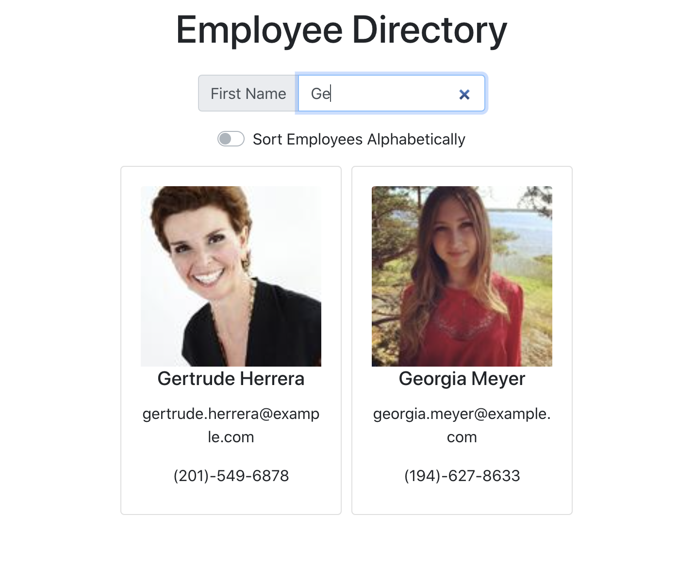

# Employee Directory

[](https://opensource.org/licenses/MIT)

# Unit 19 React Homework: Employee Directory


## Description

An application that allows the user to view a list of employees and their 

## Table of Contents

- [Employee Directory](#employee-directory)
- [Unit 19 React Homework: Employee Directory](#unit-19-react-homework-employee-directory)
  - [Description](#description)
  - [Table of Contents](#table-of-contents)
  - [Usage](#usage)
  - [Built With](#built-with)
  - [License](#license)
  - [Contributing](#contributing)
  - [Testing](#testing)
  - [Contact](#contact)
  - [Acknowledgements](#acknowledgements)
  
## Usage

```
As a user, I want to be able to view my entire employee directory at once so that I have quick access to their information.
```

View the deployed heroku application [here](https://relizabet.github.io/employee_directory/).




## Built With

- node.js
- TypeScript
- Create-React-App
- axios
- bootsrap

## License

[MIT](LICENSE)

## Contributing

To contribute to this project create a branch with the feature or correction then submit a pull request.

## Testing

No tests have been created for this application at this time.

## Contact

Please direct any questions or concerns directly to me via my email address listed below.

- Github: [relizabet](https://github.com/relizabet)
- Email: rachel@relizabeth.com

## Acknowledgements

- Giphy Capture
- Canva